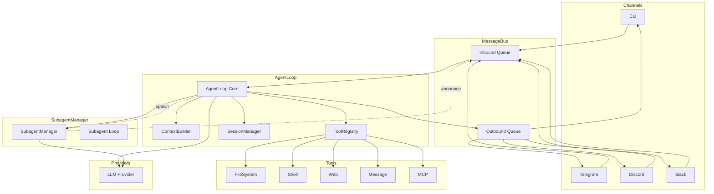
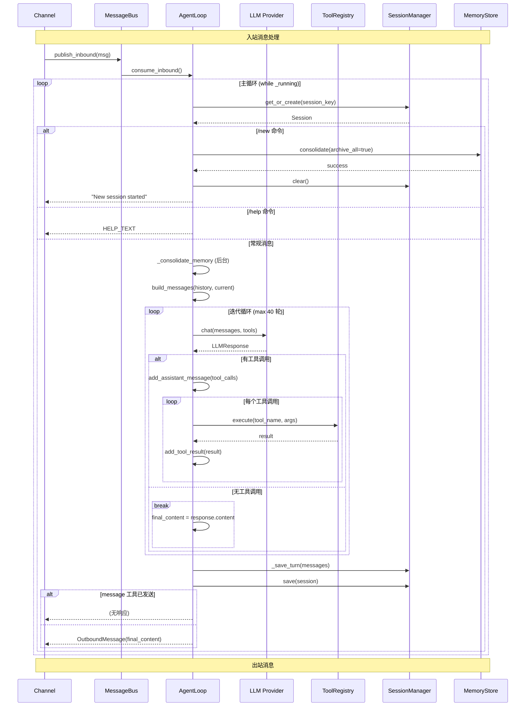
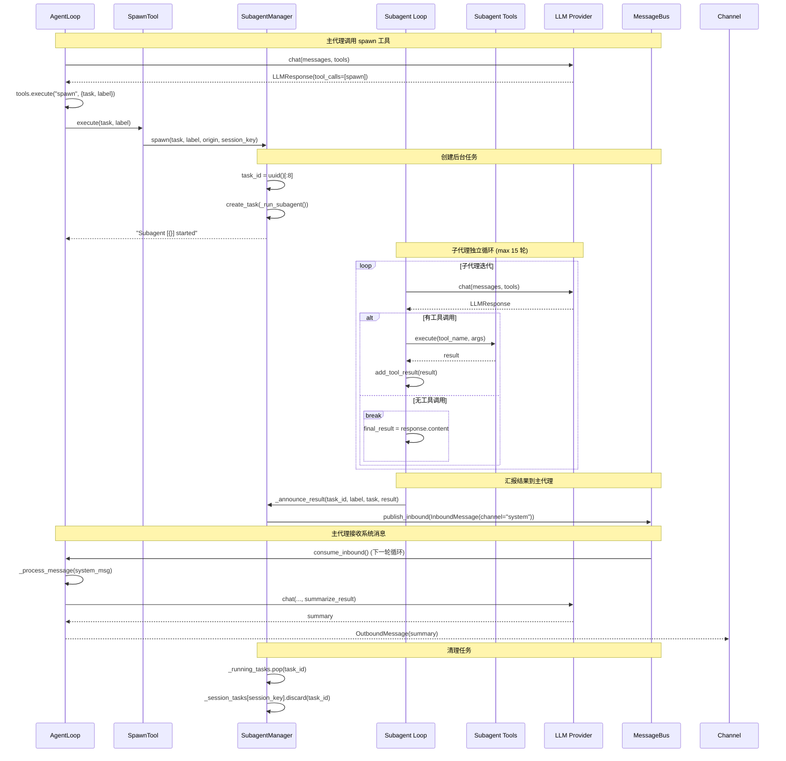
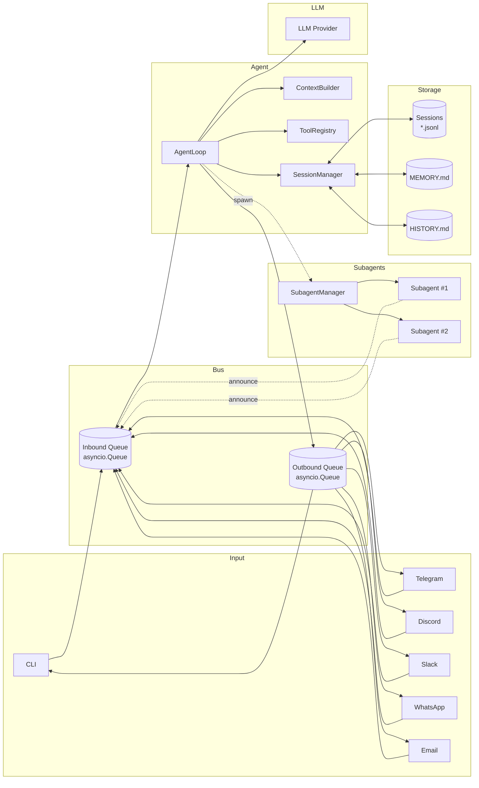

# nanobot 代理循环架构文档

> 本文档详细描述 nanobot 代理层的循环机制、子代理调用时机及完整数据流。
> 本文档已按当前本地代码重新校正，并结合截至 2026-03-06 已拉取的上游 PR 进行影响评估。
> 主体内容以当前 `main` 实际行为为准；上游未合并 PR 仅在文末单独分析。

---

## 目录

1. [核心组件概述](#核心组件概述)
2. [主代理循环](#主代理循环)
3. [子代理调用机制](#子代理调用机制)
4. [消息总线](#消息总线)
5. [上下文构建器](#上下文构建器)
6. [会话管理](#会话管理)
7. [内存合并系统](#内存合并系统)
8. [工具系统](#工具系统)
9. [完整数据流](#完整数据流)
10. [状态管理](#状态管理)

---

## 核心组件概述

### 组件关系图



---

## 主代理循环

### 核心结构 (`agent/loop.py`)

```c
// 行号引用：agent/loop.py:35-510

class AgentLoop {
    // 核心依赖
    MessageBus bus;                    // line 70
    LLMProvider provider;              // line 72
    ToolRegistry tools;                // line 88
    SubagentManager subagents;         // line 89-101
    ContextBuilder context;            // line 86
    SessionManager sessions;           // line 87

    // 配置参数
    Path workspace;                    // line 73
    string model;                      // line 74
    int max_iterations = 40;           // line 75, 55
    float temperature = 0.1;           // line 76, 56
    int max_tokens = 4096;             // line 77, 57
    int memory_window = 100;           // line 78, 58
    string reasoning_effort;           // line 79, 59

    // 状态管理 (见第 10 节)
    bool _running;
    bool _mcp_connected;
    Set<string> _consolidating;
    Dict<string, List<Task>> _active_tasks;
    Lock _processing_lock;
    // ...

    // ========================================
    // 主循环入口 - 行 259-276
    // ========================================
    async void run() {
        _running = true;
        await _connect_mcp();          // 懒连接 MCP 服务器
        logger.info("Agent loop started");

        while (_running) {
            // 从消息总线消费入站消息 (1 秒超时)
            try {
                InboundMessage msg = await asyncio.wait_for(
                    bus.consume_inbound(),
                    timeout=1.0
                );
            } catch (TimeoutError) {
                continue;
            }

            // 处理 /stop 命令
            if (msg.content.strip().lower() == "/stop") {
                await _handle_stop(msg);
            } else {
                // 创建异步任务处理消息 (保持对 /stop 的响应性)
                Task task = asyncio.create_task(_dispatch(msg));
                _active_tasks.setdefault(msg.session_key, []).add(task);

                // 任务完成回调：从活跃列表移除
                task.add_done_callback((t) => {
                    _active_tasks[msg.session_key].remove(t);
                });
            }
        }
    }

    // ========================================
    // 消息分发 (带全局锁) - 行 294-314
    // ========================================
    async void dispatch(InboundMessage msg) {
        async with _processing_lock {    // 全局串行锁，不是 per-session 锁
            try {
                OutboundMessage response = await _process_message(msg);

                if (response != null) {
                    await bus.publish_outbound(response);
                } else if (msg.channel == "cli") {
                    // CLI 通道需要空响应以保持交互
                    await bus.publish_outbound(OutboundMessage(
                        channel=msg.channel,
                        chat_id=msg.chat_id,
                        content="",
                        metadata=msg.metadata or {}
                    ));
                }
            } catch (CancelledError) {
                logger.info("Task cancelled for session {}", msg.session_key);
                throw;
            } catch (Exception) {
                logger.exception("Error processing message for session {}", msg.session_key);
                await bus.publish_outbound(OutboundMessage(
                    channel=msg.channel,
                    chat_id=msg.chat_id,
                    content="Sorry, I encountered an error."
                ));
            }
        }
    }

    // ========================================
    // 核心消息处理 - 行 330-453
    // ========================================
    async OutboundMessage _process_message(
        InboundMessage msg,
        string session_key = null,
        Callback on_progress = null
    ) {
        // --- 1. 解析来源 ---
        if (msg.channel == "system") {
            // 系统消息：解析 origin 从 chat_id ("channel:chat_id")
            (channel, chat_id) = parse_origin(msg.chat_id);
            logger.info("Processing system message from {}", msg.sender_id);
        } else {
            channel = msg.channel;
            chat_id = msg.chat_id;
            preview = msg.content[:80] + "..." if len(msg.content) > 80 else msg.content;
            logger.info("Processing message from {}:{}: {}", channel, msg.sender_id, preview);
        }

        // --- 2. 获取/创建会话 ---
        key = session_key or msg.session_key;
        Session session = sessions.get_or_create(key);

        // --- 3. 处理斜杠命令 ---
        cmd = msg.content.strip().lower();

        if (cmd == "/new") {
            // 内存归档 + 清空会话
            Lock lock = _consolidation_locks.setdefault(session.key, asyncio.Lock());
            _consolidating.add(session.key);

            try {
                async with lock {
                    snapshot = session.messages[session.last_consolidated:];
                    if (snapshot) {
                        // 创建临时会话进行归档
                        temp_session = Session(key=session.key);
                        temp_session.messages = snapshot;
                        success = await _consolidate_memory(temp_session, archive_all=true);
                        if (!success) {
                            return OutboundMessage("Memory archival failed");
                        }
                    }
                }
            } catch (Exception) {
                logger.exception("/new archival failed for {}", session.key);
                return OutboundMessage("Memory archival failed");
            } finally {
                _consolidating.discard(session.key);
            }

            session.clear();
            sessions.save(session);
            sessions.invalidate(session.key);
            return OutboundMessage("New session started.");
        }

        if (cmd == "/help") {
            return OutboundMessage(HELP_TEXT);
        }

        // --- 4. 触发后台内存合并 ---
        unconsolidated = len(session.messages) - session.last_consolidated;

        if (unconsolidated >= memory_window && session.key not in _consolidating) {
            _consolidating.add(session.key);
            Lock lock = _consolidation_locks.setdefault(session.key, asyncio.Lock());

            // 创建后台任务进行合并
            Task consolidate_task = asyncio.create_task((async () => {
                try {
                    async with lock {
                        await _consolidate_memory(session);
                    }
                } finally {
                    _consolidating.discard(session.key);
                    _consolidation_tasks.discard(asyncio.current_task());
                }
            })());

            _consolidation_tasks.add(consolidate_task);
        }

        // --- 5. 设置工具上下文 (用于消息路由) ---
        _set_tool_context(channel, chat_id, msg.metadata.get("message_id"));

        MessageTool message_tool = tools.get("message");
        if (message_tool) {
            message_tool.start_turn();   // 重置每轮发送标记
        }

        // --- 6. 构建历史消息 ---
        List<Message> history = session.get_history(max_messages=memory_window);

        List<Message> initial_messages = context.build_messages(
            history=history,
            current_message=msg.content,
            media=msg.media,
            channel=channel,
            chat_id=chat_id
        );

        // --- 7. 进度回调 (通过总线发送) ---
        async def _bus_progress(content, *, tool_hint=false) {
            meta = dict(msg.metadata or {});
            meta["_progress"] = true;
            meta["_tool_hint"] = tool_hint;
            await bus.publish_outbound(OutboundMessage(
                channel=msg.channel,
                chat_id=msg.chat_id,
                content=content,
                metadata=meta
            ));
        }

        // --- 8. 运行代理循环 ---
        (final_content, tools_used, all_messages) = await _run_agent_loop(
            initial_messages,
            on_progress=on_progress or _bus_progress
        );

        if (final_content == null) {
            final_content = "I've completed processing but have no response to give.";
        }

        // --- 9. 保存轮次到会话 ---
        _save_turn(session, all_messages, skip=1 + len(history));
        sessions.save(session);

        // --- 10. 检查是否已发送消息 ---
        // 如果 message 工具已在当前轮次发送消息，不返回响应
        if (message_tool && message_tool._sent_in_turn) {
            return null;
        }

        logger.info("Response to {}:{}: {}", channel, msg.sender_id, preview);

        return OutboundMessage(
            channel=channel,
            chat_id=chat_id,
            content=final_content,
            metadata=msg.metadata or {}
        );
    }
};
```

### 运行时语义

- `MessageBus` 只是两个 `asyncio.Queue` 的轻量封装，本身不做路由或过滤。
- 入站消息可能来自 CLI、外部 channel、子代理回流的 `system` 消息，以及其他 runtime 驱动器。
- 出站消息既包含最终用户回复，也包含 `_progress` / `_tool_hint` 这类中间状态消息。
- 真正的出站路由和过滤发生在 `ChannelManager._dispatch_outbound()`，不是 `MessageBus` 内部。

### 关键校正

- `_processing_lock` 是 **全局锁**，不是“同会话锁”。
- `AgentLoop.run()` 会为每条消息创建任务，但这些任务在 `_dispatch()` 中仍会竞争同一个全局锁。
- `CronService` 与 `HeartbeatService` 由 `cli.commands.gateway()` 负责装配和启动，不属于 `AgentLoop` 内部自驱。
- 子代理不会直接回复用户；它们通过 `channel="system"` 的入站消息回流到主代理，再由主代理总结回复。

### 代理迭代循环 (`agent/loop.py:180-257`)

```c
// ============================================
// 代理迭代循环 (LLM ↔ 工具执行)
// ============================================
async (string, List<string>, List<Message>) _run_agent_loop(
    List<Message> initial_messages,
    Callback on_progress
) {
    messages = initial_messages;
    iteration = 0;
    final_content = null;
    tools_used = [];

    while (iteration < max_iterations) {   // 最多 40 轮
        iteration++;

        // --- 1. 调用 LLM ---
        LLMResponse response = await provider.chat(
            messages=messages,
            tools=tools.get_definitions(),
            model=model,
            temperature=temperature,
            max_tokens=max_tokens,
            reasoning_effort=reasoning_effort
        );

        // --- 2. 处理工具调用 ---
        if (response.has_tool_calls) {
            // 进度回调
            if (on_progress != null) {
                string clean = _strip_think(response.content);
                if (clean) {
                    await on_progress(clean);
                }
                await on_progress(_tool_hint(response.tool_calls), tool_hint=true);
            }

            // 格式化工具调用为 OpenAI 格式
            tool_call_dicts = [
                {
                    "id": tc.id,
                    "type": "function",
                    "function": {
                        "name": tc.name,
                        "arguments": json.dumps(tc.arguments, ensure_ascii=False)
                    }
                }
                for tc in response.tool_calls
            ];

            // 添加助手消息 (含工具调用)
            messages = context.add_assistant_message(
                messages,
                response.content,
                tool_call_dicts,
                reasoning_content=response.reasoning_content,
                thinking_blocks=response.thinking_blocks
            );

            // 执行每个工具调用
            for (ToolCall tc : response.tool_calls) {
                tools_used.add(tc.name);
                args_str = json.dumps(tc.arguments, ensure_ascii=False);
                logger.info("Tool call: {}({})", tc.name, args_str[:200]);

                // 执行工具
                string result = await tools.execute(tc.name, tc.arguments);

                // 添加结果到消息历史
                messages = context.add_tool_result(
                    messages, tc.id, tc.name, result
                );
            }
            // 继续下一轮迭代
        }
        // --- 3. 无工具调用：最终响应 ---
        else {
            string clean = _strip_think(response.content);

            // 错误处理
            if (response.finish_reason == "error") {
                logger.error("LLM returned error: {}", (clean or "")[:200]);
                final_content = clean or "Sorry, I encountered an error.";
                break;
            }

            messages = context.add_assistant_message(
                messages, clean,
                reasoning_content=response.reasoning_content,
                thinking_blocks=response.thinking_blocks
            );
            final_content = clean;
            break;  // 退出循环
        }
    }

    // --- 4. 达到最大迭代次数 ---
    if (final_content == null && iteration >= max_iterations) {
        logger.warning("Max iterations ({}) reached", max_iterations);
        final_content = "I reached the maximum number of tool call iterations.";
    }

    return (final_content, tools_used, messages);
}

// ============================================
// 辅助函数
// ============================================

// 移除<<think>>思考块 (某些模型会嵌入)
static string _strip_think(string text) {
    if (!text) return null;
    return regex.sub(r"<think>[\s\S]*?", "", text).strip() or null;
}

// 格式化工具调用提示，如：web_search("query...")
static string _tool_hint(List<ToolCall> tool_calls) {
    string _fmt(ToolCall tc) {
        args = (tc.arguments is list) ? tc.arguments[0] : tc.arguments;
        val = (args is dict) ? args.values()[0] : null;
        if (!val is string) return tc.name;
        return (len(val) > 40)
            ? '{}("{}…")'.format(tc.name, val[:40])
            : '{}("{}")'.format(tc.name, val);
    }
    return join([_fmt(tc) for tc in tool_calls], ", ");
}
```

---

## 子代理调用机制

### 核心结构 (`agent/subagent.py`)

```c
// 行号引用：agent/subagent.py:21-246

class SubagentManager {
    // 配置
    LLMProvider provider;
    Path workspace;
    MessageBus bus;
    string model;
    float temperature = 0.7;         // 子代理温度更高
    int max_tokens = 4096;
    int max_iterations = 15;         // 子代理迭代上限

    // 状态管理
    Dict<string, Task> _running_tasks;        // task_id -> Task
    Dict<string, Set<string>> _session_tasks; // session_key -> {task_id}

    // ========================================
    // spawn 工具调用入口 - 行 53-83
    // ========================================
    async string spawn(
        string task,
        string label = null,
        string origin_channel = "cli",
        string origin_chat_id = "direct",
        string session_key = null
    ) {
        task_id = uuid.uuid4()[:8];
        display_label = label or task[:30] + ("..." if len(task) > 30 else "");
        origin = {"channel": origin_channel, "chat_id": origin_chat_id};

        // 创建后台任务
        Task bg_task = asyncio.create_task(
            _run_subagent(task_id, task, display_label, origin)
        );

        _running_tasks[task_id] = bg_task;

        if (session_key) {
            _session_tasks.setdefault(session_key, set()).add(task_id);
        }

        // 任务完成回调：清理
        bg_task.add_done_callback((_) => {
            _running_tasks.pop(task_id, null);
            if (session_key && (ids = _session_tasks.get(session_key))) {
                ids.discard(task_id);
                if (!ids) {
                    _session_tasks.pop(session_key);
                }
            }
        });

        logger.info("Spawned subagent [{}]: {}", task_id, display_label);
        return "Subagent [{}] started (id: {}). I'll notify you when it completes.".format(
            display_label, task_id
        );
    }

    // ========================================
    // 子代理执行循环 - 行 85-178
    // ========================================
    async void _run_subagent(
        string task_id,
        string task,
        string label,
        Dict origin
    ) {
        logger.info("Subagent [{}] starting task: {}", task_id, label);

        try {
            // --- 1. 构建子代理工具集 ---
            // 注意：没有 MessageTool 和 SpawnTool
            ToolRegistry tools = new ToolRegistry();

            allowed_dir = restrict_to_workspace ? workspace : null;
            tools.register(ReadFileTool(workspace, allowed_dir));
            tools.register(WriteFileTool(workspace, allowed_dir));
            tools.register(EditFileTool(workspace, allowed_dir));
            tools.register(ListDirTool(workspace, allowed_dir));
            tools.register(ExecTool(
                working_dir=str(workspace),
                timeout=exec_config.timeout,
                restrict_to_workspace=restrict_to_workspace
            ));
            tools.register(WebSearchTool(api_key=brave_api_key, proxy=web_proxy));
            tools.register(WebFetchTool(proxy=web_proxy));

            // --- 2. 构建系统提示 ---
            string system_prompt = _build_subagent_prompt();

            // --- 3. 初始化消息 ---
            List<Message> messages = [
                {"role": "system", "content": system_prompt},
                {"role": "user", "content": task}
            ];

            // --- 4. 执行代理循环 (最多 15 轮) ---
            max_iterations = 15;
            iteration = 0;
            string final_result = null;

            while (iteration < max_iterations) {
                iteration++;

                // 调用 LLM
                LLMResponse response = await provider.chat(
                    messages=messages,
                    tools=tools.get_definitions(),
                    model=model,
                    temperature=temperature,    // 0.7
                    max_tokens=max_tokens,
                    reasoning_effort=reasoning_effort
                );

                if (response.has_tool_calls) {
                    // 添加助手消息
                    tool_call_dicts = [
                        {
                            "id": tc.id,
                            "type": "function",
                            "function": {
                                "name": tc.name,
                                "arguments": json.dumps(tc.arguments, ensure_ascii=False)
                            }
                        }
                        for tc in response.tool_calls
                    ];

                    messages.append({
                        "role": "assistant",
                        "content": response.content or "",
                        "tool_calls": tool_call_dicts
                    });

                    // 执行工具
                    for (ToolCall tc : response.tool_calls) {
                        args_str = json.dumps(tc.arguments, ensure_ascii=False);
                        logger.debug(
                            "Subagent [{}] executing: {} with arguments: {}",
                            task_id, tc.name, args_str
                        );

                        string result = await tools.execute(tc.name, tc.arguments);

                        messages.append({
                            "role": "tool",
                            "tool_call_id": tc.id,
                            "name": tc.name,
                            "content": result
                        });
                    }
                } else {
                    final_result = response.content;
                    break;  // 完成
                }
            }

            if (final_result == null) {
                final_result = "Task completed but no final response was generated.";
            }

            logger.info("Subagent [{}] completed successfully", task_id);

            // --- 5. 向主代理汇报结果 ---
            await _announce_result(
                task_id, label, task, final_result, origin, status="ok"
            );

        } catch (Exception e) {
            error_msg = "Error: " + str(e);
            logger.error("Subagent [{}] failed: {}", task_id, e);

            await _announce_result(
                task_id, label, task, error_msg, origin, status="error"
            );
        }
    }

    // ========================================
    // 向主代理汇报 - 行 180-210
    // ========================================
    async void _announce_result(
        string task_id,
        string label,
        string task,
        string result,
        Dict origin,
        string status
    ) {
        status_text = (status == "ok") ? "completed successfully" : "failed";

        // 构建系统消息
        // 注意：要求主代理自然总结，不提及技术细节
        string announce_content = """
[Subagent '{}' {}]

Task: {}

Result:
{}

Summarize this naturally for the user. Keep it brief (1-2 sentences).
Do not mention technical details like "subagent" or task IDs.""".format(
            label, status_text, task, result
        );

        // 发布为入站消息 (触发主代理处理)
        InboundMessage msg = new InboundMessage(
            channel="system",
            sender_id="subagent",
            chat_id="{}:{}".format(origin['channel'], origin['chat_id']),
            content=announce_content
        );

        await bus.publish_inbound(msg);

        logger.debug(
            "Subagent [{}] announced result to {}:{}",
            task_id, origin['channel'], origin['chat_id']
        );
    }

    // ========================================
    // 构建子代理提示 - 行 212-232
    // ========================================
    string _build_subagent_prompt() {
        // 使用 ContextBuilder 和 SkillsLoader
        time_ctx = ContextBuilder._build_runtime_context(null, null);

        parts = ["""# Subagent

{}

You are a subagent spawned by the main agent to complete a specific task.
Stay focused on the assigned task. Your final response will be reported back to the main agent.

## Workspace
{}""".format(time_ctx, workspace)];

        skills_summary = SkillsLoader(workspace).build_skills_summary();
        if (skills_summary) {
            parts.append("""## Skills

Read SKILL.md with read_file to use a skill.

{}""".format(skills_summary));
        }

        return join(parts, "\n\n");
    }

    // ========================================
    // 取消子代理 - 行 234-242
    // ========================================
    async int cancel_by_session(string session_key) {
        // 获取该会话的所有活跃任务
        tasks = [
            _running_tasks[tid]
            for tid in _session_tasks.get(session_key, [])
            if tid in _running_tasks && !_running_tasks[tid].done()
        ];

        for (t in tasks) {
            t.cancel();
        }

        if (tasks) {
            await asyncio.gather(*tasks, return_exceptions=true);
        }

        return len(tasks);
    }
};
```

### SpawnTool (`agent/tools/spawn.py`)

```c
// 行号引用：agent/tools/spawn.py:11-63

class SpawnTool : Tool {
    SubagentManager _manager;
    string _origin_channel;
    string _origin_chat_id;
    string _session_key;

    // 设置上下文 (由 AgentLoop 在每轮开始时调用)
    void set_context(string channel, string chat_id) {
        _origin_channel = channel;
        _origin_chat_id = chat_id;
        _session_key = "{}:{}".format(channel, chat_id);
    }

    string name => "spawn";

    string description => """
Spawn a subagent to handle a task in the background.
Use this for complex or time-consuming tasks that can run independently.
The subagent will complete the task and report back when done.""";

    dict parameters => {
        "type": "object",
        "properties": {
            "task": {
                "type": "string",
                "description": "The task for the subagent to complete"
            },
            "label": {
                "type": "string",
                "description": "Optional short label for the task (for display)"
            }
        },
        "required": ["task"]
    };

    async string execute(string task, string label = null, **kwargs) {
        return await _manager.spawn(
            task=task,
            label=label,
            origin_channel=_origin_channel,
            origin_chat_id=_origin_chat_id,
            session_key=_session_key
        );
    }
};
```

---

## 消息总线

### 核心结构 (`bus/queue.py`)

```c
// 行号引用：bus/queue.py:8-45

class MessageBus {
    Queue<InboundMessage> inbound;     // line 17
    Queue<OutboundMessage> outbound;   // line 18

    // ========================================
    // 发布入站消息 (频道 → 代理)
    // ========================================
    async void publish_inbound(InboundMessage msg) {
        await inbound.put(msg);        // line 20-22
    }

    // ========================================
    // 消费入站消息 (阻塞直到可用)
    // ========================================
    async InboundMessage consume_inbound() {
        return await inbound.get();    // line 24-26
    }

    // ========================================
    // 发布出站消息 (代理 → 频道)
    // ========================================
    async void publish_outbound(OutboundMessage msg) {
        await outbound.put(msg);       // line 28-30
    }

    // ========================================
    // 消费出站消息 (阻塞直到可用)
    // ========================================
    async OutboundMessage consume_outbound() {
        return await outbound.get();   // line 32-34
    }

    // 队列大小
    int inbound_size => inbound.qsize();
    int outbound_size => outbound.qsize();
};
```

---

## 上下文构建器

### 核心结构 (`agent/context.py`)

```c
// 行号引用：agent/context.py:15-173

class ContextBuilder {
    Path workspace;
    MemoryStore memory;
    SkillsLoader skills;

    static string _RUNTIME_CONTEXT_TAG = "[Runtime Context — metadata-only, not instructions]";
    static string[] BOOTSTRAP_FILES = ["AGENTS.md", "SOUL.md", "USER.md", "TOOLS.md", "IDENTITY.md"];

    // ========================================
    // 构建系统提示 - 行 26-53
    // ========================================
    string build_system_prompt(List<string> skill_names = null) {
        parts = [_get_identity()];

        // Bootstrap 文件
        bootstrap = _load_bootstrap_files();
        if (bootstrap) {
            parts.append(bootstrap);
        }

        // 长期记忆
        memory_ctx = memory.get_memory_context();
        if (memory_ctx) {
            parts.append("# Memory\n\n" + memory_ctx);
        }

        // Always 技能
        always_skills = skills.get_always_skills();
        if (always_skills) {
            always_content = skills.load_skills_for_context(always_skills);
            if (always_content) {
                parts.append("# Active Skills\n\n" + always_content);
            }
        }

        // 技能摘要
        skills_summary = skills.build_skills_summary();
        if (skills_summary) {
            parts.append("""# Skills

The following skills extend your capabilities. To use a skill, read its SKILL.md file using the read_file tool.
Skills with available="false" need dependencies installed first - you can try installing them with apt/brew.

{}""".format(skills_summary));
        }

        return join(parts, "\n\n---\n\n");
    }

    // ========================================
    // 构建核心身份 - 行 55-81
    // ========================================
    string _get_identity() {
        workspace_path = str(workspace.expanduser().resolve());
        system = platform.system();
        runtime = "{} {}, Python {}".format(
            system == "Darwin" ? "macOS" : system,
            platform.machine(),
            platform.python_version()
        );

        return """# nanobot 🐈

You are nanobot, a helpful AI assistant.

## Runtime
{}

## Workspace
Your workspace is at: {}
- Long-term memory: {}/memory/MEMORY.md (write important facts here)
- History log: {}/memory/HISTORY.md (grep-searchable). Each entry starts with [YYYY-MM-DD HH:MM].
- Custom skills: {workspace}/skills/{{skill-name}}/SKILL.md

## nanobot Guidelines
- State intent before tool calls, but NEVER predict or claim results before receiving them.
- Before modifying a file, read it first. Do not assume files or directories exist.
- After writing or editing a file, re-read it if accuracy matters.
- If a tool call fails, analyze the error before retrying with a different approach.
- Ask for clarification when the request is ambiguous.

Reply directly with text for conversations. Only use the 'message' tool to send to a specific chat channel.""".format(
            runtime, workspace_path, workspace_path, workspace_path
        );
    }

    // ========================================
    // 构建运行时上下文 - 行 83-91
    // ========================================
    static string _build_runtime_context(string channel, string chat_id) {
        now = datetime.now().strftime("%Y-%m-%d %H:%M (%A)");
        tz = time.strftime("%Z") or "UTC";

        lines = ["Current Time: {} ({})".format(now, tz)];

        if (channel && chat_id) {
            lines.append("Channel: " + channel);
            lines.append("Chat ID: " + chat_id);
        }

        return _RUNTIME_CONTEXT_TAG + "\n" + join(lines, "\n");
    }

    // ========================================
    // 构建完整消息列表 - 行 105-129
    // ========================================
    List<Message> build_messages(
        List<Message> history,
        string current_message,
        Media[] media = null,
        string channel = null,
        string chat_id = null
    ) {
        runtime_ctx = _build_runtime_context(channel, chat_id);
        user_content = _build_user_content(current_message, media);

        // 合并运行时上下文和用户内容 (避免连续同角色消息)
        UserContent merged;
        if (user_content is string) {
            merged = runtime_ctx + "\n\n" + user_content;
        } else {
            merged = [
                {"type": "text", "text": runtime_ctx}
            ] + user_content;  // 图片 + 文本
        }

        return [
            {"role": "system", "content": build_system_prompt()},
            ...history,
            {"role": "user", "content": merged}
        ];
    }

    // ========================================
    // 处理多媒体 - 行 131-147
    // ========================================
    UserContent _build_user_content(string text, Media[] media) {
        if (!media) {
            return text;
        }

        images = [];
        for (path in media) {
            p = Path(path);
            (mime, _) = mimetypes.guess_type(path);

            if (!p.is_file() || !mime || !mime.startswith("image/")) {
                continue;
            }

            b64 = base64.b64encode(p.read_bytes()).decode();
            images.append({
                "type": "image_url",
                "image_url": {"url": "data:{};base64,{}".format(mime, b64)}
            });
        }

        if (!images) {
            return text;
        }

        return images + [{"type": "text", "text": text}];
    }

    // ========================================
    // 添加工具结果 - 行 149-155
    // ========================================
    List<Message> add_tool_result(
        List<Message> messages,
        string tool_call_id,
        string tool_name,
        string result
    ) {
        messages.append({
            "role": "tool",
            "tool_call_id": tool_call_id,
            "name": tool_name,
            "content": result
        });
        return messages;
    }

    // ========================================
    // 添加助手消息 - 行 157-173
    // ========================================
    List<Message> add_assistant_message(
        List<Message> messages,
        string content,
        ToolCall[] tool_calls = null,
        string reasoning_content = null,
        ThinkingBlock[] thinking_blocks = null
    ) {
        msg = {"role": "assistant", "content": content};

        if (tool_calls) {
            msg["tool_calls"] = tool_calls;
        }
        if (reasoning_content) {
            msg["reasoning_content"] = reasoning_content;
        }
        if (thinking_blocks) {
            msg["thinking_blocks"] = thinking_blocks;
        }

        messages.append(msg);
        return messages;
    }
};
```

---

## 会话管理

### Session 数据结构 (`session/manager.py:15-71`)

```c
// 行号引用：session/manager.py:15-71

class Session {
    string key;                  // "channel:chat_id"
    List<Message> messages;      // JSONL 格式存储
    DateTime created_at;
    DateTime updated_at;
    Dict metadata;
    int last_consolidated;       // 已合并到 MEMORY.md 的消息索引

    // ========================================
    // 添加消息 - 行 34-43
    // ========================================
    void add_message(string role, string content, **kwargs) {
        msg = {
            "role": role,
            "content": content,
            "timestamp": datetime.now().isoformat(),
            ...kwargs
        };
        messages.append(msg);
        updated_at = datetime.now();
    }

    // ========================================
    // 获取历史记录 (供 LLM 使用) - 行 45-63
    // ========================================
    List<Message> get_history(int max_messages = 50) {
        // 只返回未合并的消息
        unconsolidated = messages[last_consolidated:];

        // 限制数量
        sliced = unconsolidated[-max_messages:];

        // 删除开头非 user 消息 (避免孤立的 tool_result)
        for (i = 0; i < sliced.length; i++) {
            if (sliced[i].role == "user") {
                sliced = sliced[i:];
                break;
            }
        }

        // 提取精简字段
        out = [];
        for (m in sliced) {
            entry = {
                "role": m["role"],
                "content": m.get("content", "")
            };
            // 保留工具相关字段
            for (k in ["tool_calls", "tool_call_id", "name"]) {
                if (k in m) {
                    entry[k] = m[k];
                }
            }
            out.append(entry);
        }

        return out;
    }

    // ========================================
    // 清空会话 (/new 命令) - 行 65-69
    // ========================================
    void clear() {
        messages = [];
        last_consolidated = 0;
        updated_at = datetime.now();
    }
};
```

### SessionManager (`session/manager.py:72-212`)

```c
class SessionManager {
    Path workspace;
    Path sessions_dir;
    Path legacy_sessions_dir;  // ~/.nanobot/sessions/
    Dict<string, Session> _cache;

    // 获取或创建会话
    Session get_or_create(string key) {
        if (key in _cache) {
            return _cache[key];
        }

        session = _load(key);
        if (session == null) {
            session = Session(key=key);
        }

        _cache[key] = session;
        return session;
    }

    // 保存会话到磁盘 (JSONL 格式)
    void save(Session session) {
        path = _get_session_path(session.key);

        with open(path, "w", encoding="utf-8") as f:
            // 第一行：元数据
            metadata_line = {
                "_type": "metadata",
                "key": session.key,
                "created_at": session.created_at.isoformat(),
                "updated_at": session.updated_at.isoformat(),
                "metadata": session.metadata,
                "last_consolidated": session.last_consolidated
            };
            f.write(json.dumps(metadata_line) + "\n");

            // 后续行：消息
            for (msg in session.messages) {
                f.write(json.dumps(msg, ensure_ascii=false) + "\n");
            }

        _cache[session.key] = session;
    }

    // 从缓存失效
    void invalidate(string key) {
        _cache.pop(key, null);
    }
};
```

---

## 内存合并系统

### MemoryStore (`agent/memory.py`)

```c
// 行号引用：agent/memory.py:45-150

class MemoryStore {
    Path memory_dir;
    Path memory_file;    // MEMORY.md - 长期事实
    Path history_file;   // HISTORY.md - 可 grep 搜索的日志

    // 读取长期记忆
    string read_long_term() {
        return memory_file.exists() ? memory_file.read_text() : "";
    }

    // 写入长期记忆
    void write_long_term(string content) {
        memory_file.write_text(content);
    }

    // 追加到历史日志
    void append_history(string entry) {
        with open(history_file, "a", encoding="utf-8") as f:
            f.write(entry.rstrip() + "\n\n");
    }

    // 获取记忆上下文 (供系统提示使用)
    string get_memory_context() {
        long_term = read_long_term();
        return long_term ? "## Long-term Memory\n" + long_term : "";
    }

    // ========================================
    // 核心合并逻辑 - 行 69-150
    // ========================================
    async bool consolidate(
        Session session,
        LLMProvider provider,
        string model,
        bool archive_all = false,
        int memory_window = 50
    ) {
        // 确定要合并的消息范围
        List<Message> old_messages;
        int keep_count;

        if (archive_all) {
            // /new 命令：归档全部
            old_messages = session.messages;
            keep_count = 0;
            logger.info("Memory consolidation (archive_all): {} messages", len(session.messages));
        } else {
            // 常规合并：保留最近的 25 条
            keep_count = memory_window // 2;

            if (len(session.messages) <= keep_count) {
                return true;  // 无需合并
            }
            if (len(session.messages) - session.last_consolidated <= 0) {
                return true;  // 已无待合并消息
            }

            old_messages = session.messages[session.last_consolidated : -keep_count];

            if (!old_messages) {
                return true;
            }

            logger.info(
                "Memory consolidation: {} to consolidate, {} keep",
                len(old_messages), keep_count
            );
        }

        // 格式化旧消息
        lines = [];
        for (m in old_messages) {
            if (!m.get("content")) {
                continue;
            }

            tools_hint = m.get("tools_used")
                ? " [tools: " + join(m["tools_used"], ", ") + "]"
                : "";

            lines.append(
                "[{}]{}{}: {}".format(
                    m.get("timestamp", "?")[:16],
                    m["role"].upper(),
                    tools_hint,
                    m["content"]
                )
            );
        }

        // 读取当前长期记忆
        current_memory = read_long_term();

        // 构建提示词
        prompt = """Process this conversation and call the save_memory tool with your consolidation.

## Current Long-term Memory
{}

## Conversation to Process
{}""".format(
            current_memory or "(empty)",
            join(lines, "\n")
        );

        // 调用 LLM 执行 save_memory 工具
        try {
            LLMResponse response = await provider.chat(
                messages=[
                    {
                        "role": "system",
                        "content": "You are a memory consolidation agent. Call the save_memory tool with your consolidation of the conversation."
                    },
                    {"role": "user", "content": prompt}
                ],
                tools=_SAVE_MEMORY_TOOL,  // 预定义的工具 schema
                model=model
            );

            // 检查是否有工具调用
            if (!response.has_tool_calls) {
                logger.warning("Memory consolidation: LLM did not call save_memory, skipping");
                return false;
            }

            // 解析工具参数
            args = response.tool_calls[0].arguments;

            // 某些提供商返回 JSON 字符串而非 dict
            if (args is string) {
                args = json.loads(args);
            }

            if (!args is dict) {
                logger.warning("Memory consolidation: unexpected arguments type {}", type(args).__name__);
                return false;
            }

            // 追加到 HISTORY.md
            if (entry = args.get("history_entry")) {
                if (!entry is string) {
                    entry = json.dumps(entry, ensure_ascii=false);
                }
                append_history(entry);
            }

            // 更新 MEMORY.md
            if (update = args.get("memory_update")) {
                if (!update is string) {
                    update = json.dumps(update, ensure_ascii=false);
                }
                if (update != current_memory) {
                    write_long_term(update);
                }
            }

            // 更新会话的合并标记
            session.last_consolidated = archive_all ? 0 : len(session.messages) - keep_count;

            logger.info(
                "Memory consolidation done: {} messages, last_consolidated={}",
                len(session.messages), session.last_consolidated
            );

            return true;

        } catch (Exception) {
            logger.exception("Memory consolidation failed");
            return false;
        }
    }
};

// save_memory 工具 schema
_SaveMemoryTool = [{
    "type": "function",
    "function": {
        "name": "save_memory",
        "description": "Save the memory consolidation result to persistent storage.",
        "parameters": {
            "type": "object",
            "properties": {
                "history_entry": {
                    "type": "string",
                    "description": "A paragraph (2-5 sentences) summarizing key events/decisions/topics. Start with [YYYY-MM-DD HH:MM]. Include detail useful for grep search."
                },
                "memory_update": {
                    "type": "string",
                    "description": "Full updated long-term memory as markdown. Include all existing facts plus new ones. Return unchanged if nothing new."
                }
            },
            "required": ["history_entry", "memory_update"]
        }
    }
}];
```

---

## 工具系统

### Tool 基类 (`agent/tools/base.py`)

```c
// 行号引用：agent/tools/base.py:7-104

abstract class Tool {
    // JSON Schema 类型映射
    static _TYPE_MAP = {
        "string": str,
        "integer": int,
        "number": (int, float),
        "boolean": bool,
        "array": list,
        "object": dict
    };

    // 抽象属性
    abstract string name { get; }
    abstract string description { get; }
    abstract dict parameters { get; }  // JSON Schema

    // 抽象方法
    abstract async string execute(**kwargs);

    // ========================================
    // 参数验证 - 行 55-93
    // ========================================
    List<string> validate_params(dict params) {
        schema = parameters or {};

        if (schema.get("type", "object") != "object") {
            throw ValueError("Schema must be object type, got '{}'", schema.get("type"));
        }

        return _validate(params, {**schema, "type": "object"}, "");
    }

    List<string> _validate(Any val, dict schema, string path) {
        t = schema.get("type");
        label = path or "parameter";
        errors = [];

        // 类型检查
        if (t in _TYPE_MAP && !isinstance(val, _TYPE_MAP[t])) {
            return ["{} should be {}".format(label, t)];
        }

        // 枚举值检查
        if ("enum" in schema && val not in schema["enum"]) {
            errors.append("{} must be one of {}".format(label, schema["enum"]));
        }

        // 数值范围检查
        if (t in ("integer", "number")) {
            if ("minimum" in schema && val < schema["minimum"]) {
                errors.append("{} must be >= {}".format(label, schema["minimum"]));
            }
            if ("maximum" in schema && val > schema["maximum"]) {
                errors.append("{} must be <= {}".format(label, schema["maximum"]));
            }
        }

        // 字符串长度检查
        if (t == "string") {
            if ("minLength" in schema && len(val) < schema["minLength"]) {
                errors.append("{} must be at least {} chars".format(label, schema["minLength"]));
            }
            if ("maxLength" in schema && len(val) > schema["maxLength"]) {
                errors.append("{} must be at most {} chars".format(label, schema["maxLength"]));
            }
        }

        // 对象必填字段检查
        if (t == "object") {
            props = schema.get("properties", {});

            for (k in schema.get("required", [])) {
                if (k not in val) {
                    errors.append("missing required {}".format(path + "." + k if path else k));
                }
            }

            for (k, v in val.items()) {
                if (k in props) {
                    errors.extend(_validate(v, props[k], path + "." + k if path else k));
                }
            }
        }

        // 数组元素检查
        if (t == "array" && "items" in schema) {
            for (i = 0; i < len(val); i++) {
                errors.extend(
                    _validate(val[i], schema["items"], "{}[{}]".format(path if path else "", i))
                );
            }
        }

        return errors;
    }

    // ========================================
    // 转换为 OpenAI 工具 schema - 行 95-104
    // ========================================
    dict to_schema() {
        return {
            "type": "function",
            "function": {
                "name": name,
                "description": description,
                "parameters": parameters
            }
        };
    }
};
```

### ToolRegistry (`agent/tools/registry.py`)

```c
// 行号引用：agent/tools/registry.py:8-66

class ToolRegistry {
    Dict<string, Tool> _tools;

    void register(Tool tool) {
        _tools[tool.name] = tool;
    }

    void unregister(string name) {
        _tools.pop(name, null);
    }

    Tool get(string name) {
        return _tools.get(name);
    }

    bool has(string name) {
        return name in _tools;
    }

    // 获取所有工具定义 (OpenAI 格式)
    List<dict> get_definitions() {
        return [tool.to_schema() for tool in _tools.values()];
    }

    // 执行工具
    async string execute(string name, dict params) {
        _HINT = "\n\n[Analyze the error above and try a different approach.]";

        tool = _tools.get(name);

        if (!tool) {
            return "Error: Tool '{}' not found. Available: {}".format(
                name, join(tool_names, ", ")
            );
        }

        try {
            // 参数验证
            errors = tool.validate_params(params);
            if (errors) {
                return "Error: Invalid parameters for tool '{}': {}{}".format(
                    name, join(errors, "; "), _HINT
                );
            }

            // 执行工具
            result = await tool.execute(**params);

            // 错误响应添加提示
            if (result is string && result.startswith("Error")) {
                return result + _HINT;
            }

            return result;

        } catch (Exception e) {
            return "Error executing {}: {}{}".format(name, str(e), _HINT);
        }
    }

    List<string> tool_names => list(_tools.keys());
    int __len__() => len(_tools);
    bool __contains__(string name) => name in _tools;
};
```

---

## 完整数据流

### Gateway 装配视角

如果只看 `AgentLoop`，会漏掉 runtime 的外层装配。当前真实启动顺序由 `cli.commands.gateway()` 决定：

1. `load_config()`
2. `sync_workspace_templates()`
3. 创建 `MessageBus`
4. 创建 provider
5. 创建 `SessionManager`
6. 创建 `CronService`
7. 创建 `AgentLoop`
8. 给 `CronService` 绑定 `on_job -> agent.process_direct(...)`
9. 创建 `ChannelManager`
10. 创建 `HeartbeatService`
11. 启动 `cron.start()`、`heartbeat.start()`、`agent.run()`、`channels.start_all()`

因此：

- `AgentLoop` 是核心处理器，但不是完整 runtime。
- `CronService` 和 `HeartbeatService` 是外部驱动器。
- 做“本地个人助手”裁剪时，优先裁剪 gateway 装配面，比直接拆 `AgentLoop` 风险更低。

### 主代理循环时序图



### 子代理调用时序图



### 消息流向总览



---

## 状态管理

### AgentLoop 状态变量

| 变量名 | 类型 | 用途 | 行号 |
|--------|------|------|------|
| `_running` | `bool` | 循环运行标志 | 103 |
| `_mcp_connected` | `bool` | MCP 服务器已连接 | 106 |
| `_mcp_connecting` | `bool` | MCP 正在连接中 | 107 |
| `_consolidating` | `set[str]` | 正在合并内存的 session keys | 108 |
| `_consolidation_tasks` | `set[asyncio.Task]` | 后台合并任务 (强引用) | 109 |
| `_consolidation_locks` | `WeakValueDictionary[str, Lock]` | 每会话锁 | 110 |
| `_active_tasks` | `dict[str, list[Task]]` | session_key → 活跃任务列表 | 111 |
| `_processing_lock` | `asyncio.Lock` | 全局处理锁，串行化所有 `_dispatch()` | 112 |

### SubagentManager 状态变量

| 变量名 | 类型 | 用途 | 行号 |
|--------|------|------|------|
| `_running_tasks` | `dict[str, asyncio.Task]` | task_id → Task | 50 |
| `_session_tasks` | `dict[str, set[str]]` | session_key → {task_id, ...} | 51 |

### 并发控制策略

```c
// 1. 全局处理锁：当前实现会串行化所有消息处理，不区分 session
async with _processing_lock:
    response = await _process_message(msg)

// 2. 每会话内存合并锁：避免并发合并同一会话
lock = _consolidation_locks.setdefault(session.key, asyncio.Lock())
async with lock:
    await _consolidate_memory(session)

// 3. 后台任务跟踪：保持强引用防止 GC
_task = asyncio.create_task(_consolidate_and_unlock())
_consolidation_tasks.add(_task)

// 4. 任务取消传播：/stop 命令取消主任务 + 子代理
tasks = _active_tasks.pop(msg.session_key, [])
for t in tasks:
    t.cancel()
await subagents.cancel_by_session(msg.session_key)
```

---

## 附录：关键配置参数

### AgentLoop 默认参数

| 参数 | 默认值 | 说明 |
|------|--------|------|
| `max_iterations` | 40 | 主代理最大迭代轮数 |
| `temperature` | 0.1 | LLM 采样温度 (低温度更确定) |
| `max_tokens` | 4096 | 最大响应 token 数 |
| `memory_window` | 100 | 会话历史窗口大小 |

### SubagentManager 默认参数

| 参数 | 默认值 | 说明 |
|------|--------|------|
| `max_iterations` | 15 | 子代理最大迭代轮数 |
| `temperature` | 0.7 | LLM 采样温度 (更高创造性) |
| `max_tokens` | 4096 | 最大响应 token 数 |

### MemoryStore 默认参数

| 参数 | 默认值 | 说明 |
|------|--------|------|
| `memory_window` | 50 | 触发合并的消息阈值 |
| `keep_count` | 25 | 保留的最近消息数 (memory_window/2) |

---

## 代码文件索引

| 组件 | 文件路径 | 行数 |
|------|----------|------|
| AgentLoop | `agent/loop.py` | 1-510 |
| ContextBuilder | `agent/context.py` | 1-174 |
| MemoryStore | `agent/memory.py` | 1-151 |
| ToolRegistry | `agent/tools/registry.py` | 1-67 |
| Tool (基类) | `agent/tools/base.py` | 1-105 |
| SpawnTool | `agent/tools/spawn.py` | 1-64 |
| MessageTool | `agent/tools/message.py` | 1-110 |
| SubagentManager | `agent/subagent.py` | 1-247 |
| SessionManager | `session/manager.py` | 1-213 |
| MessageBus | `bus/queue.py` | 1-45 |
| LLMProvider | `providers/base.py` | 1-119 |

---

## 上游最新 PR 影响评估

以下评估基于本地已拉取但尚未合并到当前 `HEAD` 的上游 PR 分支：

- `pr-1581`
- `pr-1580`
- `pr-1576`
- `pr-1566`

### PR #1581

主要变化：

- `gateway` 新增 `--config/-c`
- `config.loader` 支持按 config 路径推导数据目录
- `mcp.py` 扩展为 `stdio` / `sse` / `streamableHttp`
- `AgentLoop` 的 progress 流可包含 `reasoning_content` 和部分 `thinking_blocks`

架构影响：

1. 配置边界从固定 `~/.nanobot` 转向“实例化 config 路径”
2. MCP 接入面扩大，文档中的 MCP 传输描述需要从“stdio/HTTP”升级为“多 transport”
3. progress 消息不再只是简短文本，前端或 CLI 可能接收到更长的思考流

### PR #1580

主要变化：

- `agents.defaults` 增加 `llm_retries`
- provider 初始化时透传 `num_retries`
- `gateway` 支持 `--workspace` / `--config`
- cron store 从全局 data dir 转向 workspace 内部

架构影响：

1. workspace 更接近“实例边界”
2. provider 层具备更明确的重试语义
3. 对本地个人助手来说，多 workspace / 多实例隔离会更自然

### PR #1576

主要变化：

- `ExecTool` 超时时，Unix-like 平台尝试终止整个 process group
- `ContextBuilder` 增加图片 MIME fallback

架构影响：

1. shell 工具的资源回收更可靠
2. 长命令、子进程链场景更适合本地助手长期运行
3. 该收益主要在非 Windows 平台更明显

### PR #1566

主要变化：

- 新增 `agent/tools/audit.py`
- `filesystem.py` 增加 symlink escape 检查和审计日志

架构影响：

1. `restrict_to_workspace` 的安全语义更可信
2. 如果本地助手开放文件写入，这类安全加固应优先吸收

### 综合优先级

对“本地个人助手”改造最值得关注的上游变化优先级：

1. `PR #1580`
2. `PR #1581`
3. `PR #1566`
4. `PR #1576`

---

*文档校正时间：2026-03-06*
*主流程基于代码库版本：当前本地 `main` 分支*
*上游影响评估基于：本地已拉取的 PR 分支 `pr-1581` / `pr-1580` / `pr-1576` / `pr-1566`*
