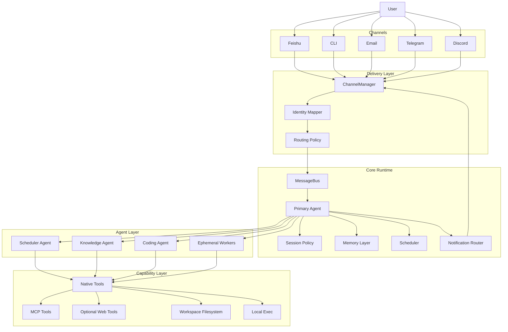
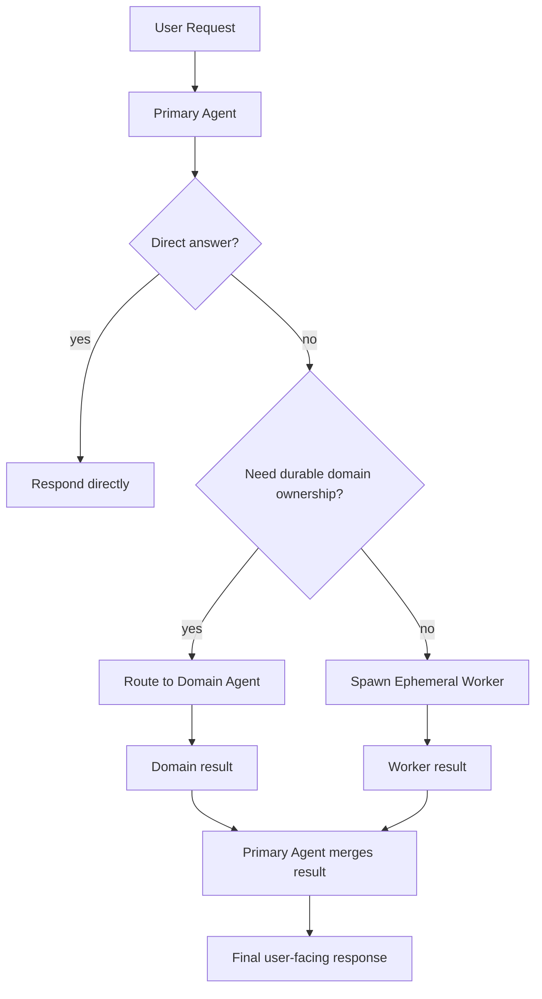

# Multi-Channel Personal Assistant Architecture

This document defines a target architecture for evolving nanobot into a multi-channel personal assistant with:

- unified user identity across channels
- one primary agent as the external assistant persona
- multiple domain agents for specialized, long-lived work
- ephemeral workers for short-lived sub-tasks

This is a target design document, not a description of current code. When the current implementation differs, this document calls that out explicitly.

Related documents:

- [`AGENT_LOOP_ARCHITECTURE.md`](/D:/Code/nanobot/AGENT_LOOP_ARCHITECTURE.md)
- [`WORKFLOW_FLOWCHART.md`](/D:/Code/nanobot/WORKFLOW_FLOWCHART.md)

## 1. Design Goal

The product goal is not "a bot on many channels".

The goal is:

- one person
- one assistant
- many touch points

That means channel diversity must not fragment:

- identity
- memory
- permissions
- task ownership
- notifications

## 2. Core Principles

1. There is exactly one `Primary Agent` persona per assistant instance.
2. Channels are delivery surfaces, not separate assistant brains.
3. `Domain Agents` may have specialized prompts, tools, and working memory, but they are not separate user-facing personas by default.
4. `Ephemeral Workers` exist for one-shot delegated work and should remain operationally cheap.
5. Long-term memory is user-centric, not channel-centric.
6. Short-term session state is interaction-centric and may be channel- or thread-scoped.
7. High-risk actions must require confirmation on a trusted channel.

## 3. Runtime Topology



## 4. Agent Roles

### 4.1 Primary Agent

The `Primary Agent` is the only default user-facing assistant persona.

Responsibilities:

- interpret user intent
- maintain unified assistant voice
- map user requests into tasks
- decide whether to answer directly or delegate
- merge outputs from domain agents
- own long-term user memory policy
- own cross-channel notification policy
- enforce confirmation and safety rules

Non-goals:

- doing every long-running task itself
- holding every domain-specific workflow internally
- exposing raw internal agent topology to the user

### 4.2 Domain Agents

`Domain Agents` are persistent specialists with narrow responsibilities.

Examples:

- `scheduler_agent`
- `knowledge_agent`
- `coding_agent`
- `monitoring_agent`
- `briefing_agent`

Responsibilities:

- maintain domain-specific working context
- use domain-specific tools
- run recurring or background jobs in their domain
- return structured outputs to the primary agent

Default communication rule:

- domain agents do not directly talk to the user
- they report back to the primary agent

Exceptions:

- explicit debug mode
- admin console mode
- domain-specific review surfaces approved by the primary agent

### 4.3 Ephemeral Workers

`Ephemeral Workers` are disposable subagents for short tasks.

Use them for:

- reading many files
- performing search/extract/transform steps
- isolated shell tasks
- bounded research or summarization

Do not use them for:

- long-lived schedules
- user memory ownership
- channel notification ownership

## 5. Identity Model

This is the most important missing layer for a real personal assistant.

Current nanobot mostly uses:

- `session_key = "{channel}:{chat_id}"`

That is not enough for a multi-channel assistant because the same user appears under different channel identities.

Target model:

```text
person_id
  -> channel identities
     -> feishu:ou_xxx
     -> telegram:123456
     -> email:user@example.com
     -> cli:local-owner
```

Recommended entities:

1. `Person`
   - canonical assistant owner or allowed user
   - stable `person_id`

2. `ChannelIdentity`
   - one record per external account on one channel

3. `ConversationSurface`
   - concrete place where an interaction happens
   - examples:
     - Feishu DM
     - Feishu group thread
     - Telegram DM
     - CLI local terminal

4. `Session`
   - short-term conversational state attached to a policy decision

## 6. Session Strategy

Do not share all short-term context across all channels. That sounds simple but usually creates confusion.

Recommended policy:

1. shared long-term memory per `person_id`
2. separate short-term sessions per interaction surface
3. optional session linking across trusted 1:1 channels

Suggested rules:

- Feishu DM and CLI may share a "personal direct" session if explicitly enabled
- group chats should have separate sessions from DMs
- different group chats should not share short-term context
- thread-aware channels should use thread-scoped session keys when available

Recommended derived session key format:

```text
session:{person_id}:{surface_type}:{surface_id}
```

Examples:

- `session:owner:feishu_dm:ou_abc`
- `session:owner:feishu_group:chat_123`
- `session:owner:cli:local`

## 7. Memory Strategy

### 7.1 Long-Term Memory

Owned by the `Primary Agent`.

Should store:

- user preferences
- standing instructions
- important projects
- recurring obligations
- trusted contacts and channels
- notification preferences

Should not store:

- raw channel noise
- transient draft content
- large tool outputs

### 7.2 Domain Memory

Each domain agent may have its own local working memory.

Examples:

- scheduler agent: calendar/task state
- coding agent: active repositories and current branch/task context
- knowledge agent: ingestion state, reading queue, topics

Rule:

- domain memory is subordinate to primary memory
- domain memory should never redefine the user's identity or global preferences

### 7.3 Current nanobot gap

Current nanobot has:

- session JSONL
- `MEMORY.md`
- `HISTORY.md`

That is a good start, but it lacks:

- person-centric identity
- separate domain memory stores
- policy-driven session sharing across channels

## 8. Channel Strategy

### 8.1 Primary channel

For a China-first usage pattern, Feishu should be treated as the primary channel.

Recommended role:

- primary user-facing channel
- default notification channel
- default confirmation channel
- default daily workflow channel

### 8.2 Secondary channels

Recommended secondary roles:

- CLI: high-control local debugging and admin operations
- Email: asynchronous summaries and fallback delivery
- Telegram/Discord: optional additional reach, not the source of truth

### 8.3 Outbound routing policy

The assistant should not reply blindly to the originating channel for every task.

Define policy categories:

1. `reply_to_origin`
   - conversational replies
   - follow-ups in the same thread

2. `notify_primary_channel`
   - scheduled reminders
   - daily summaries
   - background task completion

3. `require_confirmation_on_trusted_channel`
   - file deletion
   - command execution
   - external side effects

## 9. Delegation Model

The architecture should combine both models under explicit rules:

- one primary agent for user interaction
- many domain agents for durable specialization
- ephemeral workers for cheap bounded delegation



Decision rule:

- use `Ephemeral Worker` when the task is bounded and disposable
- use `Domain Agent` when the task recurs, owns state, or needs specialized policy

## 10. Suggested Domain Agents

For a practical first version, keep the number low.

Recommended initial set:

1. `scheduler_agent`
   - reminders
   - repeating routines
   - follow-up tasks
   - heartbeat-driven task review

2. `knowledge_agent`
   - personal notes
   - reading queue
   - information capture
   - summary generation

3. `coding_agent`
   - repo-specific work
   - file operations
   - shell execution
   - patch/review/test loops

Do not start with more than 3 domain agents.

## 11. Mapping to Current nanobot Code

### 11.1 What can be reused

These pieces are reusable:

- `ChannelManager`
- `MessageBus`
- `AgentLoop`
- `SubagentManager`
- `CronService`
- `HeartbeatService`
- filesystem/web/shell tools
- MCP integration

### 11.2 What should change

1. add an identity layer before session selection
2. split primary-agent orchestration from domain-agent execution
3. replace raw `channel:chat_id` session semantics with policy-based session keys
4. add domain-agent registry and lifecycle management
5. add notification routing policy
6. add trusted-channel confirmation policy

### 11.3 Proposed new modules

Recommended additions:

- `nanobot/identity/mapper.py`
- `nanobot/identity/models.py`
- `nanobot/routing/policy.py`
- `nanobot/agent/primary.py`
- `nanobot/agent/domain_registry.py`
- `nanobot/agent/domain_runner.py`
- `nanobot/notifications/router.py`
- `nanobot/memory/domain_store.py`

## 12. Feishu-First Design Notes

For this project, Feishu should be treated as first-class, not as "one more channel".

Recommended behavior:

1. Feishu DM is the primary control surface.
2. Feishu group chats are mention-gated and lower-trust.
3. Proactive notifications go to Feishu DM by default.
4. High-risk confirmations should prefer Feishu DM even if the original request came from another channel.
5. Domain-agent status should generally remain hidden from group chats.

## 13. Safety and Trust Model

Channel trust must be explicit.

Suggested trust tiers:

1. `trusted_private`
   - owner CLI
   - owner Feishu DM

2. `trusted_authenticated`
   - owner Telegram DM
   - verified email identity

3. `semi_trusted_group`
   - Feishu groups
   - Discord group chats

Policy examples:

- direct command execution only on `trusted_private`
- schedule creation on `trusted_private` or `trusted_authenticated`
- summaries allowed on all tiers
- destructive actions always require confirmation

## 14. Evolution Plan

### Phase 1

- keep one `Primary Agent`
- retain current subagent mechanism as `Ephemeral Worker`
- make Feishu the primary channel
- add identity mapping and session policy

### Phase 2

- add `scheduler_agent` as first true `Domain Agent`
- route cron and heartbeat outputs through primary-agent policy
- add notification routing policy

### Phase 3

- add `knowledge_agent`
- separate domain memory from primary memory
- add structured identity + preference storage

### Phase 4

- add `coding_agent`
- tighten tool policies by channel trust tier
- support richer MCP-backed domain capabilities

## 15. Implementation Priorities

If development starts now, the correct order is:

1. identity mapping
2. session policy
3. Feishu-first routing and trust policy
4. primary-agent orchestration layer
5. scheduler domain agent
6. notification router
7. domain memory separation
8. additional domain agents

## 16. Final Position

The correct design is not:

- only one agent forever
- or many equal autonomous agents exposed directly to the user

The correct design for this project is:

- one primary assistant persona
- multiple channels
- a small number of durable domain agents
- cheap ephemeral workers
- centralized identity, memory, and trust policy
