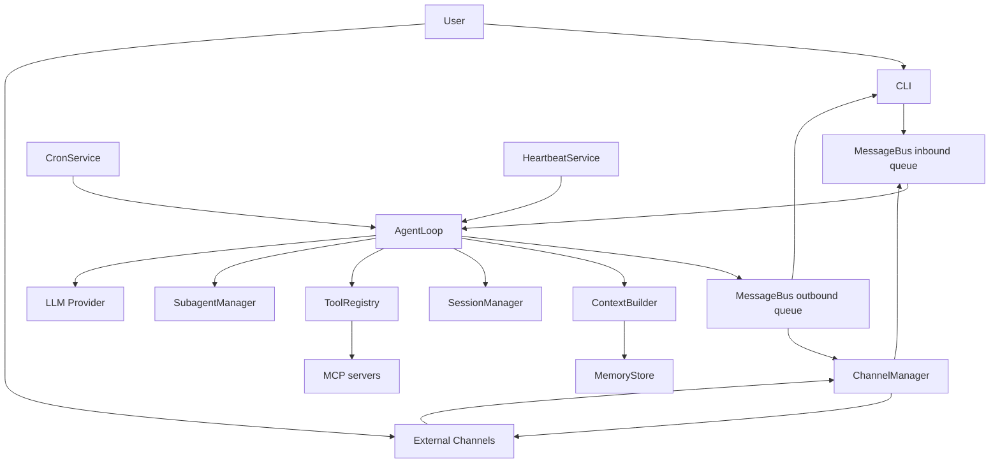
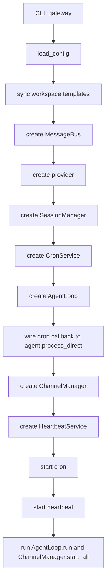
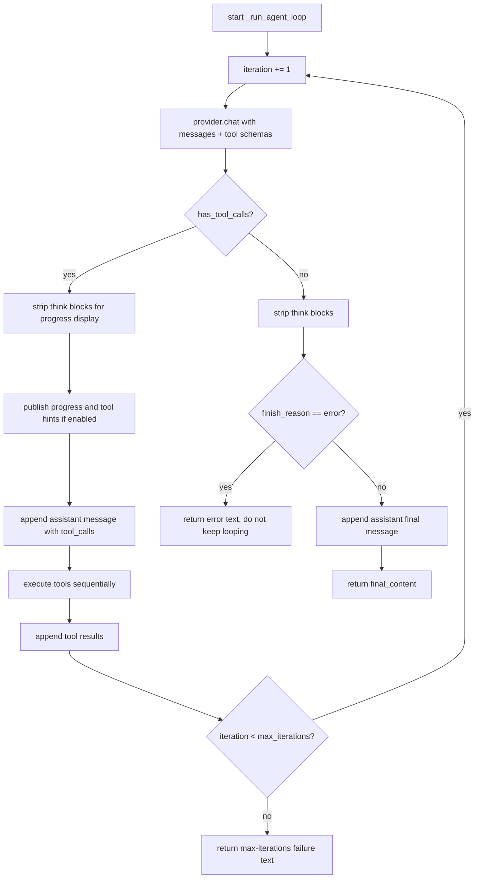
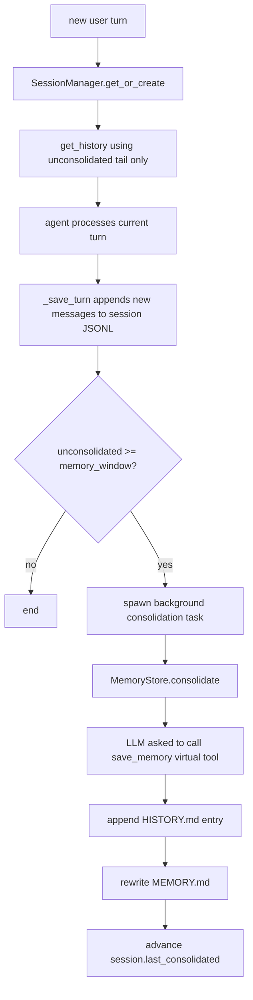
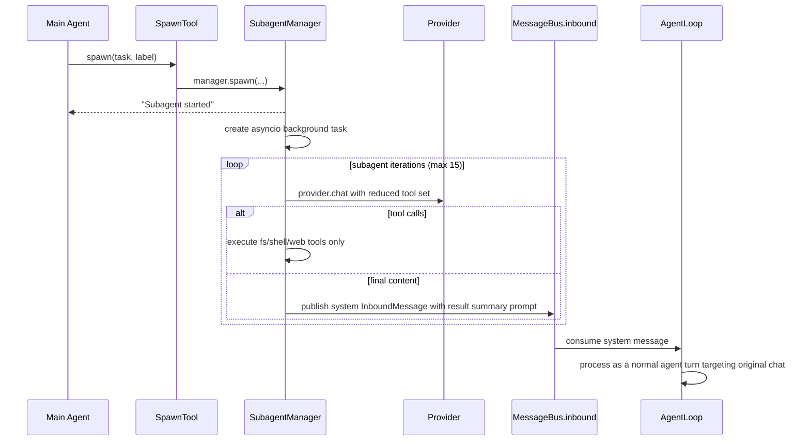
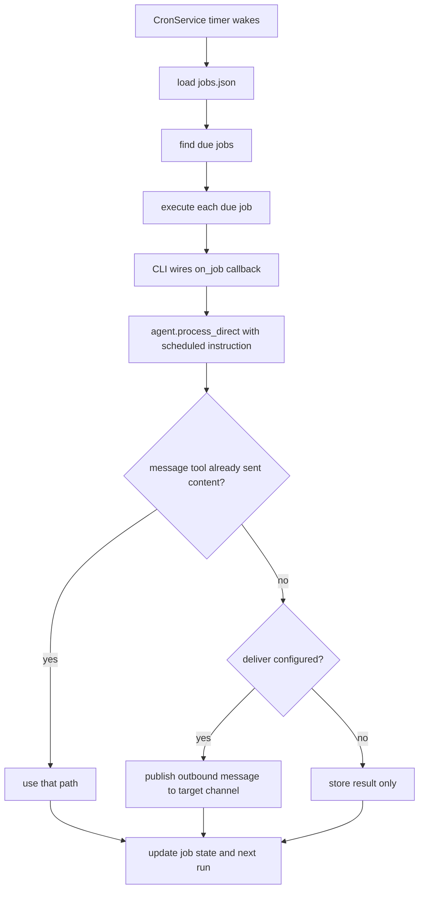

# nanobot Working Mechanism Flowchart

This document reflects the current code in this repository as of 2026-03-06.
It is intended as an implementation-faithful map for local-assistant refactoring.

Primary code references:

- `nanobot/cli/commands.py`
- `nanobot/agent/loop.py`
- `nanobot/agent/context.py`
- `nanobot/agent/subagent.py`
- `nanobot/agent/memory.py`
- `nanobot/session/manager.py`
- `nanobot/channels/manager.py`
- `nanobot/bus/queue.py`
- `nanobot/cron/service.py`
- `nanobot/heartbeat/service.py`
- `nanobot/agent/tools/mcp.py`

## 1. Runtime Topology



## 2. Gateway Startup Flow

`nanobot gateway` builds the long-running runtime. The important part is that most services are assembled in CLI code, not hidden inside `AgentLoop`.



## 3. Inbound Message Flow

This is the core path for normal user interaction.

```mermaid
sequenceDiagram
    participant User
    participant Channel as CLI/Channel
    participant Bus as MessageBus.inbound
    participant Loop as AgentLoop.run
    participant Dispatch as _dispatch
    participant Proc as _process_message
    participant Sess as SessionManager
    participant Ctx as ContextBuilder
    participant LLM as Provider
    participant Tools as ToolRegistry
    participant Out as MessageBus.outbound

    User->>Channel: send message
    Channel->>Bus: publish_inbound(InboundMessage)
    Loop->>Bus: consume_inbound()
    alt content == /stop
        Loop->>Proc: _handle_stop
    else normal message
        Loop->>Dispatch: create_task(_dispatch(msg))
        Dispatch->>Dispatch: wait for global _processing_lock
        Dispatch->>Proc: _process_message(msg)
        Proc->>Sess: get_or_create(session_key)
        Proc->>Proc: handle /new or /help if matched
        Proc->>Proc: set tool context
        Proc->>Sess: get_history(memory_window)
        Proc->>Ctx: build_messages(history, current_message, media, channel, chat_id)
        Proc->>LLM: enter _run_agent_loop()
        loop until final answer or max_iterations
            LLM-->>Proc: content or tool calls
            alt tool calls
                Proc->>Out: optional progress/tool_hint
                Proc->>Tools: execute each tool call
                Tools-->>Proc: tool results
            else final content
                Proc->>Proc: finalize response
            end
        end
        Proc->>Sess: _save_turn(...)
        Proc->>Sess: save(session)
        alt message tool already sent reply
            Proc-->>Dispatch: return None
        else normal reply
            Proc-->>Dispatch: return OutboundMessage
            Dispatch->>Out: publish_outbound(response)
        end
    end
```

## 4. Agent Iteration Loop

This is the LLM-tool-LLM loop inside one turn.



Implementation notes:

- Tool calls are executed sequentially inside one iteration.
- Progress is emitted through outbound messages with metadata flags.
- Tool results are persisted to session history in truncated form if large.

## 5. Session and Memory Flow

There are two distinct persistence layers:

- short/mid-term conversational state: `sessions/*.jsonl`
- long-term memory and searchable history: `memory/MEMORY.md` and `memory/HISTORY.md`



Important behavior:

- Consolidation is asynchronous for normal turns.
- `/new` forces archival before clearing the session.
- The session file remains append-only; consolidation does not rewrite old session messages.

## 6. Subagent Flow

Subagents are background workers started via the `spawn` tool.



Subagent constraints:

- No `message` tool in subagents.
- No nested `spawn` tool in subagents.
- Results are not sent directly to the user; they are re-injected as a system message and summarized by the main agent.

## 7. Cron Flow



## 8. Heartbeat Flow

Heartbeat is a two-phase mechanism, not a blind periodic execution loop.

```mermaid
flowchart TD
    A[Heartbeat timer wakes] --> B[read HEARTBEAT.md]
    B --> C{file exists and non-empty?}
    C -- no --> D[skip]
    C -- yes --> E[provider.chat with virtual heartbeat tool]
    E --> F{tool says action == run?}
    F -- no --> G[skip]
    F -- yes --> H[on_execute callback -> agent.process_direct(tasks)]
    H --> I{response available and on_notify set?}
    I -- no --> J[end]
    I -- yes --> K[publish outbound message to last routable channel/chat]
```

## 9. Outbound Delivery Flow

```mermaid
flowchart TD
    A[Agent or tool publishes OutboundMessage] --> B[MessageBus.outbound]
    B --> C[ChannelManager dispatcher consumes]
    C --> D{progress message?}
    D -- yes --> E{send_progress/send_tool_hints enabled?}
    E -- no --> F[drop]
    E -- yes --> G[resolve target channel]
    D -- no --> G
    G --> H{channel exists?}
    H -- no --> I[log unknown channel]
    H -- yes --> J[channel.send(msg)]
```

## 10. Refactor-Relevant Constraints

These are the most important facts to preserve when modifying the project.

1. `_processing_lock` in `AgentLoop` is global, not per session.
2. `run()` creates one task per inbound message, but those tasks serialize on the same lock.
3. Progress updates use the same outbound queue as normal user-visible responses.
4. Session state is append-only JSONL plus a consolidation offset.
5. Memory consolidation is LLM-mediated and therefore probabilistic.
6. Subagent completion is routed back through the main agent, not directly to the user.
7. MCP tools are connected lazily at runtime and wrapped as native tools.
8. Channel startup policy is fail-closed when `allow_from` is an empty list.

## 11. Suggested Refactor Order for a Local Personal Assistant

If the goal is a local-first personal assistant, this is the lowest-risk refactor sequence:

1. Freeze the channel surface: keep CLI only at first.
2. Split `AgentLoop` lock strategy from global lock to per-session lock.
3. Decide whether memory consolidation should remain LLM-driven or become rule-based.
4. Isolate tool policy: local filesystem, local shell, optional web, optional MCP.
5. Rework prompt/bootstrap loading so workspace instructions are explicit and testable.
6. Add deterministic tests around message flow before changing channel or memory behavior.
