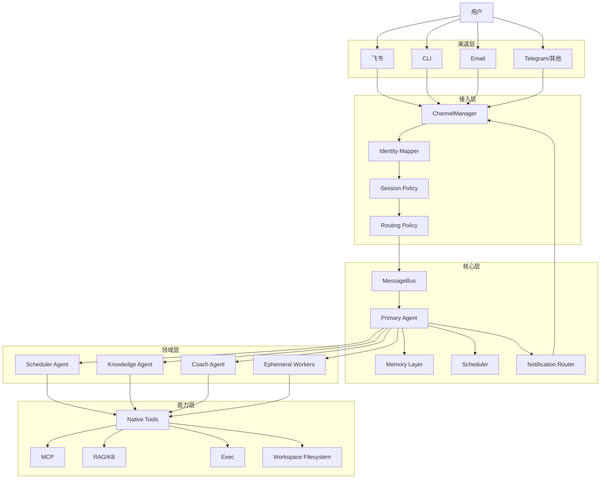

# 学习助手通用底座设计

本文档定义的是“学习助手通用底座”，不是泛化到所有行业的万能助手，也不是只靠提示词堆出来的专项机器人。

目标是为后续的公考助手、技术学习助手、论文学习助手提供可复用的基础能力。

---

## 一、定位

底座层解决的是以下问题：

1. 多渠道可触达
2. 同一用户跨渠道身份统一
3. 学习任务可被调度、跟踪、提醒
4. 长短期记忆有明确边界
5. 主 agent 与领域 agent 有稳定分工
6. 后续可接 RAG、定时器、疲劳干预、专项技能

它不直接解决：

1. 公考专有话语体系
2. 某一门学科的教学策略
3. 某一考试的专项题型套路

这些应放到专项能力层。

---

## 二、核心目标

学习助手底座必须支持：

1. 一个人在多个渠道触达同一个助手
2. 助手能识别“你是谁”而不是只识别“你在哪个 chat_id”
3. 助手能持续维护学习状态，而不是每次对话重新开始
4. 助手能主动提醒、调度、复盘，而不是只被动问答
5. 助手能按任务调用不同领域 agent，而不是所有逻辑都塞进一个 prompt

---

## 三、目标架构

---

## 四、核心组件职责

### 1. Primary Agent

唯一对外人格。

职责：

1. 理解用户意图
2. 判断是否需要直接回答
3. 判断是否应该委派给领域 agent
4. 汇总领域 agent 结果
5. 维护统一语气、统一人格、统一长期记忆
6. 决定消息应该回哪个渠道

### 2. Scheduler Agent

负责学习调度，而不是讲解知识本身。

职责：

1. 生成每日学习计划
2. 交错学习编排
3. 倒计时训练
4. 休息与恢复协议触发
5. 复盘任务生成

### 3. Knowledge Agent

负责知识材料和检索增强能力。

职责：

1. 知识库问答
2. 资料总结
3. 语料注入
4. 基于材料生成提纲/摘要/对比

### 4. Coach Agent

负责教学交互与认知支架。

职责：

1. 苏格拉底式追问
2. 错题复盘
3. 费曼式解释训练
4. 学习策略提示

### 5. Ephemeral Workers

一次性执行器，不拥有长期身份。

适合：

1. 批量读文件
2. 短时检索
3. 有边界的 shell/web 任务

---

## 五、身份模型

当前 nanobot 主要按 `channel:chat_id` 建 session。

这对多渠道学习助手不够。

应引入：

### 1. Person

一个真实用户的统一身份。

字段建议：

1. `person_id`
2. `display_name`
3. `primary_channel`
4. `trusted_channels`
5. `preferences`

### 2. ChannelIdentity

用户在不同渠道上的身份映射。

字段建议：

1. `person_id`
2. `channel`
3. `external_user_id`
4. `is_verified`

### 3. ConversationSurface

具体交互面。

例如：

1. 飞书私聊
2. 飞书群聊
3. CLI
4. 邮件线程

---

## 六、会话策略

不建议所有渠道共享同一个短期 session。

推荐：

1. 长期记忆按 `person_id` 共享
2. 短期 session 按 surface 分离
3. 可信 1:1 渠道可选共享“直连会话”

建议规则：

1. 飞书私聊是主会话面
2. CLI 可以作为高信任直连会话
3. 群聊与私聊隔离
4. 不同群聊隔离
5. 线程型渠道尽量 thread-scoped

---

## 七、记忆策略

### 1. 用户长期记忆

存：

1. 学习目标
2. 长期计划
3. 偏好
4. 常用资料
5. 通知偏好
6. 已知弱项/强项

### 2. 领域记忆

每个领域 agent 有自己的工作记忆。

例如：

1. scheduler agent 记学习计划与节奏
2. knowledge agent 记资料索引与知识热点
3. coach agent 记近期错误模式

### 3. 会话记忆

只用于近期对话连贯性，不应污染长期记忆。

---

## 八、渠道策略

### 1. 飞书优先

对国内使用场景，飞书应作为主入口。

建议：

1. 飞书私聊为主控制面
2. 飞书群聊为 mention 触发面
3. 主动通知优先飞书私聊
4. 高风险确认优先在飞书私聊完成

### 2. CLI 角色

CLI 不作为唯一入口，但应保留：

1. 调试入口
2. 高保真控制台
3. 管理员模式

### 3. Email 角色

适合作为：

1. 摘要投递
2. 学习日报/周报
3. 异步兜底

---

## 九、工具策略

学习助手底座应默认支持：

1. 文件读取与编辑
2. 受控 shell
3. RAG/资料检索
4. 定时任务
5. 通知发送
6. 可选 MCP

默认原则：

1. `restrict_to_workspace = true`
2. web 工具按需开启
3. shell 工具受 allowlist 控制
4. 高风险操作需要可信渠道确认

---

## 十、和当前 nanobot 的关系

可复用：

1. `ChannelManager`
2. `MessageBus`
3. `AgentLoop`
4. `SubagentManager`
5. `CronService`
6. `HeartbeatService`
7. MCP 接入
8. 现有 tool 基础设施

需要新增：

1. `identity mapper`
2. `session policy`
3. `notification router`
4. `domain agent registry`
5. `domain memory store`

---

## 十一、底座阶段的完成标准

完成下面这些，才算学习助手底座可用：

1. 飞书 + CLI 可统一触达同一个助手
2. 用户身份能跨渠道合并
3. 学习计划能被调度并回推
4. 长短期记忆有清晰边界
5. 至少有一个真正的 domain agent 在运行
6. 可通过技能系统切换学习模式

---

## 十二、第一阶段成果固化（2026-03-06）

截至 2026-03-06，第一阶段通用底座已经完成并通过 Gate A / Gate B / Gate C 联调。

### 1. 已完成的底座能力

1. 跨渠道身份统一：`feishu + cli` 可绑定到同一 `person_id`
2. 会话策略统一：支持 DM / group / thread / system 的独立 session 语义
3. 主编排闭环：`PrimaryAgentOrchestrator` 已支持 `direct / sync / async / event`
4. Domain runtime：已支持 agent factory 装配、descriptor、async job、finished job drain
5. 通知路由：异步与主动提醒可按 `person_id` 路由到主直连渠道
6. 首个真实业务 agent：`scheduler_agent`
7. 首批学习模式：`shenlun-mode`、`xingce-drill`
8. 主动提醒闭环：已完成 API 级闭环与真实 Feishu 主动提醒冒烟

### 2. 已验证的运行口径

当前已验证并建议继续沿用的运行口径如下：

1. Feishu 为主直连渠道
2. CLI 为高信任辅助直连渠道
3. 群聊与私聊隔离
4. thread 型 surface 独立隔离
5. scheduler 状态固定落盘到 `workspace/domain_agents/scheduler/state.json`
6. 学习模式状态固定保存在 session metadata 的 `learning_mode` 字段

### 3. 当前通用底座的边界

第一阶段完成不意味着后续业务永远不需要调整底座，只意味着：

1. 后续新增 domain agent 不需要重做身份、会话、通知三层基础设施
2. 后续新增学习模式不需要重写主循环或重做 session 模型
3. 后续新增主动提醒类能力可复用现有 orchestrator + runtime + notification router
4. 更复杂的多 agent 协作、可视化运维、更多渠道实链路验证，仍属于后续增强项

